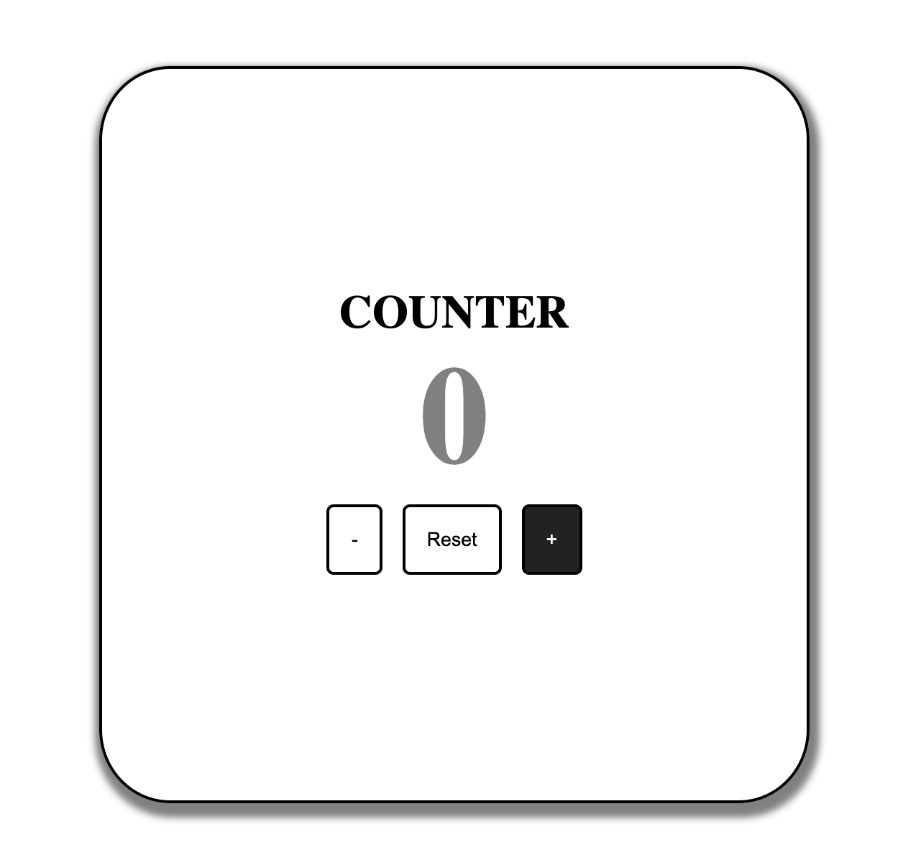

[![Contributors][contributors-shield]][contributors-url]
[![Issues][issues-shield]][issues-url]
[![Forks][forks-shield]][forks-url]
[![Stargazers][stars-shield]][stars-url]
[![LinkedIn][linkedin-shield]][linkedin-url]

# Counter
[![NPM Version][npm-image]][npm-url]
[](https://cran.r-project.org/package=sass)

CounterJS is a simple counter developed in javascript. The idea of this project is to put javascript into practice but mostly to improve my skills.



### Build with
This project was built with 2 mainly technology
- Javascript
- Sass

## Getting Started

### Prerequisites
If you don't want to use it, just delete the scss folder, and apply the style changes in the styles.css file. Otherwise follow command below to install sass

```bash
npm install -g sass
```

### Installation
it's enough to clone this repo
```bash
git clone https://github.com/Gemod/CounterJS.git
```
and open in a browser index.html file.

## Usage
To use Sass, run follow command in root project, to make sure, sass generate or update styles.css file:

```bash
sass --watch scss/styles.scss css/styles.css
```

## Contact
Gemod -  [@Twitter](https://twitter.com/gemod994)

<!--MARKDOWN LINKS AND IMAGES-->
[contributors-shield]: https://img.shields.io/github/contributors/Gemod/CounterJS.svg?style=for-the-badge
[contributors-url]: https://github.com/Gemod/CounterJS/graphs/contributors
[issues-shield]: https://img.shields.io/github/issues/Gemod/CounterJS.svg?style=for-the-badge
[issues-url]:https://github.com/Gemod/CounterJS/issues
[linkedin-shield]: https://img.shields.io/badge/-LinkedIn-black.svg?style=for-the-badge&logo=linkedin&colorB=555
[linkedin-url]: https://www.linkedin.com/in/gennaro-modafferi-a27540ba/
[forks-shield]: https://img.shields.io/github/forks/Gemod/CounterJS.svg?style=for-the-badge
[forks-url]: https://github.com/Gemod/CounterJS/fork
[stars-shield]: https://img.shields.io/github/stars/Gemod/CounterJS.svg?style=for-the-badge
[stars-url]: https://github.com/Gemod/CounterJS/stargazers

[npm-image]: https://img.shields.io/npm/v/datadog-metrics.svg?style=flat-square
[npm-url]: https://npmjs.org/package/datadog-metrics
[npm-downloads]: https://img.shields.io/npm/dm/datadog-metrics.svg?style=flat-square
